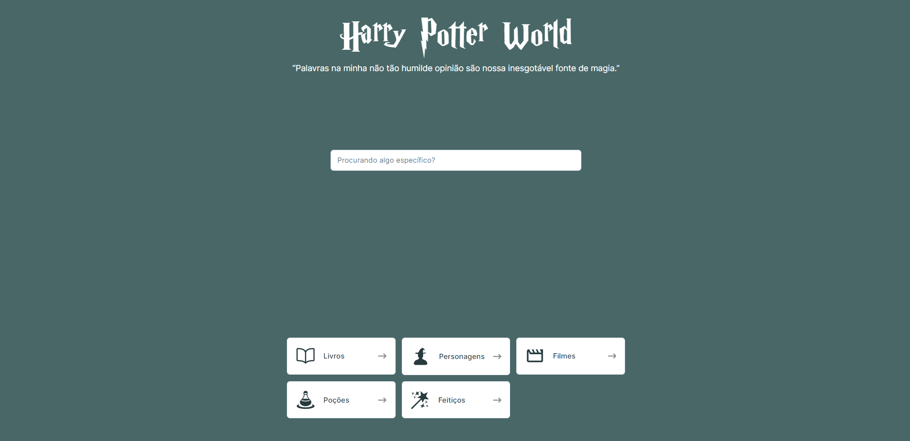

<h1 align="center">
  Harry Potter World
</h1>

Desafio técnico da Proesc

  

 

## Tecnologias

Este projeto foi desenvolvido com as seguintes tecnologias:

- React
- Next
- TypeScript
- Tailwind CSS
- Shadcn/ui
- React Query
- Vitest
- Cypress

## Execute o projeto

1. Clone este repositório `git clone https://github.com/dudunog/potter-book.git`
2. Entre no diretório do projeto `cd potter-book`
3. Instale as dependências com `yarn install` ou `npm install`
4. Inicie o projeto em modo desenvolvimento com `yarn run dev` ou `npm run dev`
